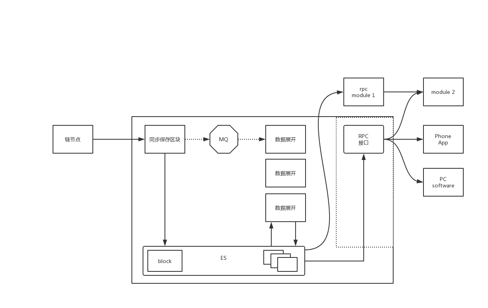

[[TOC]]

# external db 介绍

## 起因

 在开发完一个合约后，在后续的项目中会收到各种各样的需求， 主要提现在和业务相关的各种查询。
 要满足各种需求，不可避免的需要在合约的各种查询的rpc接口， 如果没有对应的数据，还需要在本
 地执行中加入各种代码加入代码，产生数据。

 举例: 比较严重是的trade合约，需要根据各种条件组合进行查询，里面的查询接口陆续增加。但依然
 不能满足需求。

```
trade 合约接口 https://chain.33.cn/document/105
1.1 查询地址对应的买单
1.2 分状态查询地址的买单
1.3 显示一个token 指定数量的买单
1.4 显示指定token出售者的一个或多个token 或 不指定token 的卖单
1.5 显示指定状态下的某地址卖单
1.6 显示一个用户成交的所有买单
1.7 显示一个用户成交的指定一个或者多个token所有买单
1.8 显示一个token 指定数量的卖单
1.15 根据状态分页列出某地址的订单（包括买单卖单）
```

 table 模块的引入，让产生数据变的方便， 但由于低层实现是基于kvdb，也就是要提前生成数据。
 需要提前预测可能的需求。并只解决了产生数据的问题，查询接口还是要随着需求而添加。

```
 table 模块
 "github.com/33cn/chain33/common/db/table"
```

 第二点在于，这些代码都在同一个工程里， 修改后需要更新节点， 同步数据。这以为着需要配置控制
 各类数据是否生成， 或在其他不需要这些数据的节点， 浪费存储资源。现在很多节点存储是40G。

 优点: 及时性最强， 在执行时直接生成。 

 
## 目标

在保证及时性的同时，满足下面的要求
 1. 在各种项目有不同需求时， 不需要去改动节点的代码
 1. 能容易的实现各种项目的需求
 1. 把原本不需要的代码从合约中或从chain33 & plugin的项目中移除，
 1. 减少因项目而在节点机器增加的存储

## 基础设施

 1. Push-Sequence 功能: 区块推送功能。 需要区块的服务，可以在节点上注册接受区块的地址，在产生区块后，节点主动推送。
 1. ElasticSearch： 将数据导入，可以实现花式查询(想这么查就怎么查)

## externaldb 整体设计

 

模块说明
 1. 同步模块：接受区块推送，保存区块到ES/MQ
 1. 数据展开模块：实现特定业务的数据展开。从ES/MQ读区块，将展开数据写入到ES
 1. ES/MQ: 开源项目. ES做数据库，(MQ 还没用上)
 1. RPC接口: 提供数据查询。
    1. 原计划这部分由相关的项目来开发
    1. 非PC/手机端的数据请求，直接开放ES访问

 理想情况下：我们后续开发只需要实现数据展开模块中， 将一个交易和执行结果转换为特定的
 几个数据结构即可。


## 现状

 1. 查询接口: 实际上只有部分项目有人自己开发。
 1. 数据流: 写入数据流缺MQ 这条线。所有数据通信都是通过ES
    1. 新的推送可以通过存入ES，实现完整的功能
    1. 同时实现ES/MQ功能来不及

## 数据组织

ES数据组织: index/type/doc
 1. index: 相当于一个数据库
 1. type: 相当于一张表
 1. doc: 相当于一条记录

具体数据划分: 不同链的数据分开， 不同类型的数据分开
 1. prefix_index/type/doc-id/
 1. prefix 不同的链不一样
 1. index/type 部分是固定的。 如帐号为 index=account type=account
 1. 同一条链的不同合约的帐号和交易信息是各自放在一起， 其他信息都独立


## 同步模块

 1. 实现http 服务，用来接受区块推送
 1. 保存收到的区块

## 数据展开模块

 1. 合约解析接口
 1. 功能组合
 1. 数据处理流程(共用)

合约解析接口
 * 每个合约实现如下接口
 * 调用一次对一个交易生成一组需要的数据(按需求) 
 
```
// SeqType
const (
	SeqTypeAdd = 1
	SeqTypeDel = 2
)
 
// TxEnv record block info
type TxEnv struct {
	Block   *types.BlockDetail // include tx and receipt
	TxIndex int64
}

type Convert interface {
	ConvertTx(env *TxEnv, op int) ([]Record, error)
}

// Record 要保存到外部数据的数据结构都要满足这个接口
type Record interface {
	Key  		// index/type/doc-id
	Operator	// C/U/D
	Append(Record) Record 
	Value() []byte
}

```

功能组合
 1. 按需求， 在模块中组合各个合约的展开功能

```
func (a *app) ConvertTx(env *db.TxEnv, op int) ([]db.Record, error) {
	tx := env.Block.Block.Txs[env.TxIndex]
	switch string(tx.Execer) {
	case a.title + "ticket":
		return ticket.NewConvert(symbol).ConvertTx(env, op)
	case a.title + "coins":
		return coins.NewConvert(symbol).ConvertTx(env, op)
	case a.title + "trade":
		return trade.NewConvert(paraTitle, symbol).ConvertTx(env, op)
	case a.title + "token":
		return token.NewConvert(symbol).ConvertTx(env, op)
	}
	return nil, nil
}

```

数据处理流程
 1. 供所有的数据展开模块调用，隐藏数据读写的细节
 1. 数据展开模块自需要处理数据本身

### trade 例子

三类数据
 * 帐号
 * 订单
 * 交易

```
// Detall  id: address-exec-asset
type Detall struct {
	Address string `json:"address"`
	Exec    string `json:"exec"` // 执行器名 和 执行器地址 等效， 可能不知道执行器名， 这时填地址
	Frozen  int64  `json:"frozen"`
	Balance int64  `json:"balance"`
	Total   int64  `json:"total"`
	Type    string `json:"type"` // contract, personage
}

// Account 记录帐号信息， Detail 解析自执行日志， 其他项在交易解析时获得
type Account struct {
	*Detall
	HeightIndex int64  `json:"height_index"`
	AssetSymbol string `json:"asset_symbol"`
	AssetExec   string `json:"asset_exec"`
}


// Order Order
type Order struct {
	*db.Block

	AssetSymbol       string `json:"asset_symbol"`
	AssetExec         string `json:"asset_exec"`
	Owner             string `json:"owner"`
	AmountPerBoardlot int64  `json:"boardlot_amount"`
	MinBoardlot       int64  `json:"min_boardlot"`
	PricePerBoardlot  int64  `json:"boardlot_price"`
	TotalBoardlot     int64  `json:"total_boardlot"`

	TradedBoardlot int64  `json:"traded_boardlot"`
	IsSellOrder    bool   `json:"is_sell"`
	IsFinished     bool   `json:"is_finished"`
	Status         string `json:"status"`

	BuyID  string `json:"buy_id"`
	SellID string `json:"sell_id"`
}

// Tx trade tx
type Tx struct {
	*db.Block
	TxType  string `json:"tx_type"`
	Success bool   `json:"success"`

	// option
	SellMarket *pty.TradeForSellMarket `json:"sell_market,omitempty"`
	SellLimit  *pty.TradeForSell       `json:"sell_limit,omitempt"`
	SellRevoke *pty.TradeForRevokeSell `json:"sell_revoke,omitempty"`
	BuyMarket  *pty.TradeForBuy        `json:"buy_market,omitempty"`
	BuyLimit   *pty.TradeForBuyLimit   `json:"buy_limit,omitempty"`
	BuyRevoke  *pty.TradeForRevokeBuy  `json:"buy_revoke,omitempty"`
}

```


## RPC

 1. jrpc
 1. 可以支持多条链
 1. 接口组合 

```
	//                   title
	supports := make(map[string]*rpc.Server)
	for _, chain := range cfg.Chain {
		server := rpc.NewServer()
		shower := MinerAccount{Host: chain.EsHost, Title: chain.Title, Prefix: chain.Prefix, Symbol:chain.Symbol}
		server.Register(&shower)

		// TODO support more
		trade := Trade{Host: chain.EsHost, Title: chain.Title, Prefix: chain.Prefix, Symbol:chain.Symbol}
		server.Register(&trade)
		acc := Account{Host: chain.EsHost, Title: chain.Title, Prefix: chain.Prefix, Symbol:chain.Symbol}
		server.Register(&acc)

		supports[chain.Title] = server
	}

```

 1. 配置部分

```
[[chain]]
title="bityuan"
prefix="5_"
esHost="http://127.0.0.1:9200/"
symbol="bty"

[[chain]]
title="user.p.bangbangchain."
prefix="bangbangchain_1_"
esHost=""
symbol=""
``` 

接口实现
 1. 原来预计是有具体项目自己实现，现在基本是我们来实现，所以在数据上尽量详细，以满足需求
 1. url: http://Host:Port/Title
    1. 通过title, 将请求转到到不同的数据源
    1. http://47.111.132.89:19991/bityuan
 1. request/response: 和现在chain33 的rpc定义一样风格
 1. 接口参数方面， 和es 的参数尽量保持一致，这样可以减少接口代码。 
    1. 现在是定义了Query结构体，支持es 的部分功能，命名和es中一致。

 * request 

```
{
        "id" : 1 ,
        "method" : "Trade.ListAsset", 
        "params":[{ 
        }]
}

```
 
 * responce

```
{
   "error" : null,
   "result" : [
      {
         "asset_symbol" : "TEST",
         "asset_exec" : "token"
      }
   ],
   "id" : 1
}

```

 * params 

```
 {
   "page" : {
      "number" : 1,
      "size" : 20
   },
   "sort" : [
      {
         "ascending" : true,
         "key" : "key"
      }
   ],
   "match" : [
      {
         "value" : "TOKEN1",
         "key" : "asset_symbol"
      },
      {
         "value" : true,
         "key" : "is_sell"
      }
   ],
   "range" : [
      {
         "key" : "boardlot_price",
         "start" : 1,
         "end" : 10
      },
      {
         "key" : "height",
         "start" : 1,
         "end" : 10000
      }
   ]
}

```


## 部署和维护

写模块可以有两种模式部署
 1. 一个同步模块加多个展开模块
    1. 对某条链增加某些数据需求的时候， 增加部署新的展开模块
    1. 开始时，是这样部署的，手动部署比较麻烦
    1. rpc 不需要切换数据源
    1. 目前有个bug还没处理，不同模块会同时修改合约的内部帐号信息
 1. 一个同步模块加一个展开模块 （目前部署方式） 
    1. 对某条链增加某些数据需求的时候， 更新展开模块，生成新的数据
    1. rpc 切换到切换到新的数据源
    1. 在切换前有额外数据存储的开销，以及全数据生成时间比增量数据生成时间慢
    1. 管理方便点

rpc 模块: 
 1. 在展开模块后开发，由于fix bug， 部署替换麻烦，目前支持一条链配置一个数据源，
    和写模块的第二种部署模块配合使用
 1. 一条链不同数据配置不同数据源，需要继续开发

## 对chain33和plugin 具体版本的依赖

由于部分插件需要获得 ActionName 等类似的信息, 需要对应版本plugin 的支持, 所以在具体项目节点升级后可能需要升级convert 模块.

## 后续

 1. 还有更多的数据需求在开发
 1. 在功能稳定后，可以向第一种部署方案过渡

