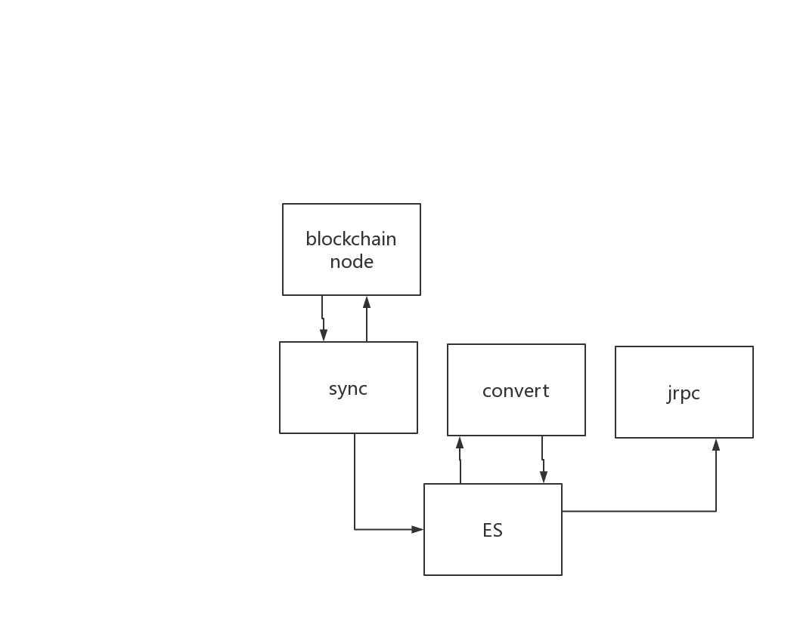

# externaldb 部署

## 整体结构介绍

由5部分组成 
 1. 外部依赖：chain33 节点
 1. 内部依赖：elastic search
 1. 模块：sync， convert， jrpc

### 依赖说明

 1. elastic search
    1. 用途 用来保存数据
    1. 配置 esHost/esHostWrite/esHostRead: 如 "http://127.0.0.1:9200/"
 1. chain33 节点
    1. 用途 用来推送区块序列
    1. 配置 节点jrpc: chain33Host "http://localhost:8801" 
    1. 配置 平行链title para="" 为平行链为空
    1. 配置 主币名称 symbol="bty"

### 模块说明

 1. sync: 同步区块序列
    1. 需要和chain33 通信
    1. 需要写 es节点
 1. convert: 展开数据
    1. 需要读写 es节点
 1. jrpc: 提供rpc 接口
    1. 需要读 es节点

配置
 1. 配置依赖相关配置项
 1. 配置数据相关项的前缀

启动
 1. ./sync -f 配置文件 >log 2>&1 &
 1. ./convert -f 配置文件 -c 节点的配置 >log 2>&1 &
 1. ./jrpc -f 配置文件 >log 2>&1 &

### sync 配置

```
# elastic search
esHost="http://127.0.0.1:9200/"

# chain33 节点
chain33Host="http://localhost:8801"
# 空为主链， 非空为title
para=""

# 接受推送的配置
pushHost="192.168.3.34:20000"
# 程序自身bind 的配置， 在云上或通过端口映射的ip/port 会不一样
pushBind="192.168.3.34:20000"

pushName="lj_test"
# 数据库前缀， 这样可以允许多条链的数据导入到一个库
prefix=""
name="bty3_sync"
```

### convert 配置


```
# 可以配置一样，
# sync-block 写数据的数据库
esHostRead="http://127.0.0.1:9200/"
prefix=""
# 展开数据保存的数据库
esHostWrite="http://127.0.0.1:9200/"
prefixWrite="7_"

# 空为主链， 非空为title
para=""
symbol="bty"

# 请不要修改
# 不为0的时候可以方便测试指定的高度
startSeq=0

# 配置链上合约地址, 用来区分合约地址和个人地址的 
# TODO 用工具生成
execAddresses=["16htvcBNSEA7fZhAdLJphDwQRQJaHpyHTp"]

appName="convert_bty3"


# 列表是全部支持的数据类型, 如果不需要整节删除

# 展开数据项配置支持
# 每类合约都会生成N中数据，按需要控制来生成的数据种类
[[data]]
# 为common时，通用配置
# 目前支持两项 ["account", "transaction"]
# transaction: 为所有合约交易生成数据： 为支持合约的交易生成更详细的数据
#              如调用的函数， 涉及的金额等
# account: 为支持的合约生成数据，因为不支持的合约不能辨别资产信息
exec="common"
# all：演示用， 把所有能展开的数据类型列出来， 方便 generate 配置
all=["account", "transaction"]
generate=["account", "transaction"]

[[data]]
exec="coins"
all=[]
generate=[]

[[data]]
exec="ticket"
all=["ticket", "bind"]
generate=["ticket", "bind"]

[[data]]
exec="unfreeze"
all=[]
generate=[]

[[data]]
exec="trade"
all=[]
generate=[]

[[data]]
exec="token"
all=[]
generate=[]

[[data]]
exec="multisig"
all=[]
generate=[]

[[stat]]
stat="block"

```

### jrpc 配置

```
# rpc 地址
host="localhost:9991"
# 白名单， 不限制为 "*"
whiteList=["*"]
name="jrpc_bty3"

[[chain]]
title="bityuan"
prefix="14_"
esHost="http://127.0.0.1:9200/"
symbol="bty"

```

 访问rpc 时URL 为 host/title, 如

```
http://127.0.0.1:9991/bityuan
```


## 现在的测试部署结构

项目起来后，平行链可能会很多, 要部署很多, jrpc 虽然支持直接做多条链的入口, 但升级或换包受到限制。 所以以链为单位部署管理比较方便和直观

在和几个项目联调尝试后， 比较有效的部署方式是 
 1. 针对链部署。即多某链部署 三个模块(sync, convert, jrpc)
 1. 接口jrpc 可以其他方式在入口聚合，再转发到对应的jrpc端口
 1. 主链数据比较多， 主链和平行链分开部署
 1. 同一个条链的不同项目， 如果没有关系， 可以共用数据， jrpc 分开。可以的话也分开部署。 不同项目的话， 涉及到数据升级可能会互相影响

## docker-compose 

 1. 生成镜像， 包含默认的配置文件。 需要根据项目配置

```
docker 镜像

make docker version=1.0.0 # 生成三个镜像

$ docker image list | grep externaldb | grep 1.0.0
chain33/externaldb/jrpc                         1.0.0               2d6bc23e5be5        21 minutes ago      138MB
chain33/externaldb/convert                      1.0.0               7a45b61851f2        21 minutes ago      137MB
chain33/externaldb/sync                         1.0.0               2d08020ef63b        22 minutes ago      140MB

```
 
 1. 准备配置文件

```
按上面3个模块的说明修改配置文件

将文件放在 docker-compose 中的指定目录下
```
 

1. docker-compose 启动

```
# 1. 确认docker-compose 中的目录和部署机器上的一致

# 2. 先启动 elasticsearch
(docker-compose  up elasticsearch >log1 2>&1  &)
# 3. 等启动成功后，启动下面三个模块
(docker-compose  up sync convert jrpc >log2 2>&1 &)
```

## 验证部署

在节点有数据的情况下(即同步好数据), 满足一下两点
 1. 可以在es 中看到数据
 1. 可以在jrpc 中读到数据

```
# 1. 可以在es 中看到数据
$ curl 'localhost:9200/_cat/indices?v'

# dc5 是我本地测试配置的前缀，有多条链数据都在 所以有grep
$ curl 'localhost:9200/_cat/indices?v' | sort  | grep dc5

yellow open   dc5_account                 w9YPIQ0uRpqjjZfDmiICrA   5   1          4            7     19.7kb         19.7kb
yellow open   dc5_last_seq                rm9zm2wCReiNNTP1lraM2g   5   1          1           37      4.5kb          4.5kb
yellow open   dc5_multisig                iVG_cwFrSzef7fQbFvacwA   5   1         10            3     37.2kb         37.2kb
yellow open   dc5_sig_list                y32h0AclQiyfUoIoOZyPRw   5   1         12            0     56.1kb         56.1kb
yellow open   dc5_sig_tx                  iwzk3dGOTlm3fnxZYO3WzA   5   1         12            0     33.4kb         33.4kb
yellow open   dc5_transaction             HZvKAxQqS-egBZbXLa1z-w   5   1         20            0    100.3kb        100.3kb

# 2. 可以在jrpc 中读到数据。
# 如果是平行链。 curl 中 bityuan 换成其他平行链的title (不要少了最后的点 ".")
# 即 jrpc 配置的 title
#  

$ curl http://localhost:20001/bityuan -X POST -d@tx.list.1..json | json_pp
{
   "id" : 1,
   "result" : [
      {
         "height_index" : 6,
         "success" : true,
         "block_hash" : "0x67c58d6ba9175313f0468ae4e0ddec946549af7748037c2fdd5d54298afd20b6",
         "fee" : 0,
         "action_name" : "genesis",
         "height" : 0,
         "block_time" : 1514533394,
         "options" : null,
         "is_withdraw" : false,
         "index" : 6,
         "next" : "",
         "to" : "1EDnnePAZN48aC2hiTDzhkczfF39g1pZZX",
         "hash" : "0x9282a2cbc1549b76ce0f09ca9b9758bff1b32f888553b861de976d4546c8310e",
         "group_count" : 0,
         "execer" : "coins",
         "amount" : 1000000000000,
         "from" : "1HT7xU2Ngenf7D4yocz2SAcnNLW7rK8d4E",
         "assets" : [],
         "is_para" : false
      },
      {
         "fee" : 0,
         "action_name" : "genesis",
         "height" : 0,
         "success" : true,
         "height_index" : 3,
         "block_hash" : "0x67c58d6ba9175313f0468ae4e0ddec946549af7748037c2fdd5d54298afd20b6",
         "hash" : "0xd29b6a7a7167100f73cbf25b8967fac4e5a9e316d20a65a4065df236849219a2",
         "group_count" : 0,
         "execer" : "coins",
         "amount" : 1000000000000,
         "from" : "1HT7xU2Ngenf7D4yocz2SAcnNLW7rK8d4E",
         "assets" : [],
         "is_para" : false,
         "block_time" : 1514533394,
         "is_withdraw" : false,
         "options" : null,
         "index" : 3,
         "next" : "",
         "to" : "1PUiGcbsccfxW3zuvHXZBJfznziph5miAo"
      }
   ],
   "error" : null
}

# 输入 tx.list.1..json 
$ cat tx.list.1..json 
{
   "id" : 1,
   "method" : "Tx.TxList",
   "params" : [
      {
         "sort" : [
            {
               "key" : "height",
               "ascending" : true
            }
         ],
         "page" : {
            "number" : 1,
            "size" : 2
         }
      }
   ]
}

```

### 注意事项

 1. 在依赖的节点，重新同步后， 数据服务也需要清理数据，重新同步
 1. 推送的名字不要重名，重名的推送被认为是一个，会把原来的推送覆盖掉。新的推送会从一半开始，但接受端不是从零开始，会报错0，导致数据同步没有像预期的一样进行。
 
